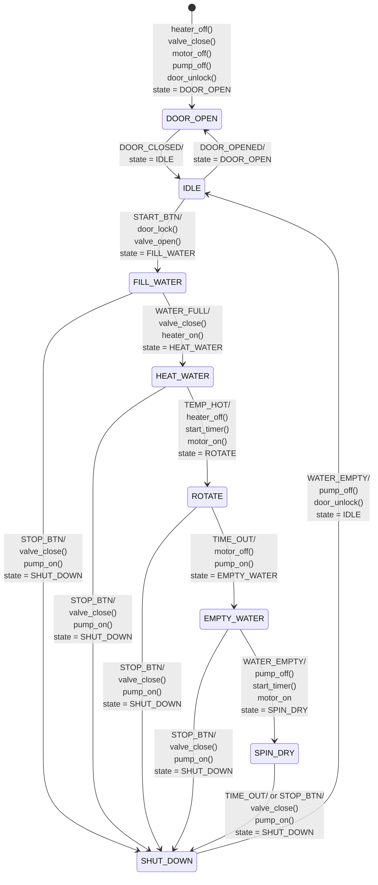

# Washing Machine State Diagram

```mermaid
stateDiagram-v2
    [*] --> DOOR_OPEN: heater_off() <br> valve_close() <br> motor_off() <br> pump_off() <br> door_unlock() <br> state = DOOR_OPEN
    
    IDLE --> DOOR_OPEN: DOOR_OPENED/ <br> state = DOOR_OPEN
    IDLE --> FILL_WATER: START_BTN/ <br> door_lock() <br> valve_open() <br> state = FILL_WATER
    
    DOOR_OPEN --> IDLE: DOOR_CLOSED/ <br> state = IDLE
    
    FILL_WATER --> HEAT_WATER: WATER_FULL/ <br> valve_close() <br> heater_on() <br> state = HEAT_WATER
    FILL_WATER --> SHUT_DOWN: STOP_BTN/ <br> valve_close() <br> pump_on() <br> state = SHUT_DOWN
    
    HEAT_WATER --> ROTATE: TEMP_HOT/ <br> heater_off() <br> start_timer() <br> motor_on() <br> state = ROTATE
    HEAT_WATER --> SHUT_DOWN: STOP_BTN/ <br> valve_close() <br> pump_on() <br> state = SHUT_DOWN
    
    ROTATE --> EMPTY_WATER: TIME_OUT/ <br> motor_off() <br> pump_on() <br> state = EMPTY_WATER
    ROTATE --> SHUT_DOWN: STOP_BTN/ <br> valve_close() <br> pump_on() <br> state = SHUT_DOWN
    
    EMPTY_WATER --> SPIN_DRY: WATER_EMPTY/ <br> pump_off() <br> start_timer() <br> motor_on <br> state = SPIN_DRY
    EMPTY_WATER --> SHUT_DOWN: STOP_BTN/ <br> valve_close() <br> pump_on() <br> state = SHUT_DOWN
    
    SPIN_DRY --> SHUT_DOWN: TIME_OUT/ or STOP_BTN/ <br> valve_close() <br> pump_on() <br> state = SHUT_DOWN
    
    SHUT_DOWN --> IDLE: WATER_EMPTY/ <br> pump_off() <br> door_unlock() <br> state = IDLE
```

