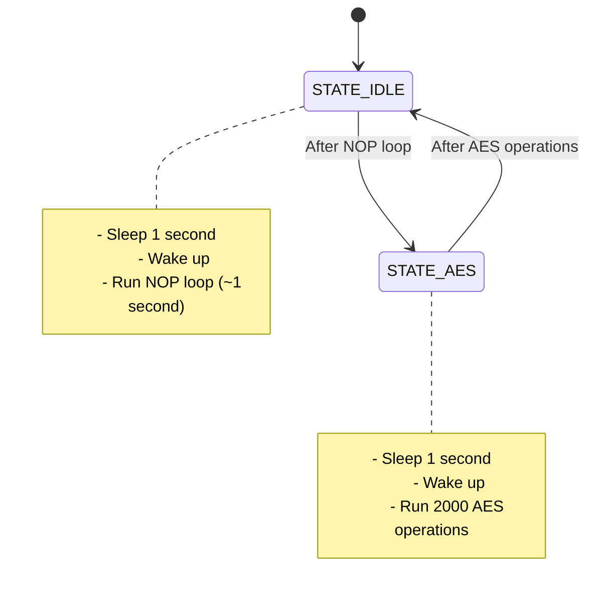

# Praktikum 2 – Energieverbrauch einer AES-Verschlüsselung auf einem ARM Cortex-M4 messen 

## Lernziele 

- Sie können eine Finite State Machine in C implementieren. 
- Sie können auf einem Embedded-System eine Energiemessung durchführen und 
berechnen. 
- Sie können mit Low-Power-Modi auf einem Embedded-System arbeiten. 
- Sie können Spannungskurven sinnvoll auf einem Oszilloskop darstellen.

## Grundlagen 
Im heutigen Laborversuch führen Sie den AES-Algorithmus auf dem STM32F429 Discovery 
Kit auf dem MC1-Board aus und messen und berechnen den Energieverbrauch. 

### Bibliothek 
In der Praktikumsvorlage finden Sie die Bibliothek P02_library.lib mit kompilierten C-
Funktionen, die Sie in diesem Versuch einsetzen können. Die folgende Tabelle gibt eine 
Übersicht zu den Modulen in der Bibliothek. 

#### Module in der P02_library.lib 
Header und deren Funktionen:
- **ese_aes.h**  Dieses Modul stellt eine Funktion zur Ver- und Entschlüsselung einer Nachricht mit dem AES Algorithmus. 
- **power_mode.h**  Mit diesem Modul definieren Sie den Clock Speed und können den Microcontroller in einen low power Status versetzen. 
- **wakeup_timer.h**  Ini2alisierung des Wakeup-Timers. Mit diesem Modul definieren Sie, nach welcher Zeitdauer der Microcontroller aus dem Sleep Modus erwacht. 
- **output.h**  Steuerung der zwei User LEDs 
- **user_button.h**  Einlesen des User Buttons 
- **aes.h**  Implementa2on AES Ver- und Entschlüsselung. In diesem Header File kann die Schlüssellänge variiert werden. 

### Ziel 
Da Verschlüsselungsalgorithmen prinzipbedingt einen hohen Rechenaufwand benötigen, 
lohnt es sich, den Energie- und Zeitaufwand ihrer Ausführung zu messen. Insbesondere bei 
Embedded-Systemen, die unabhängig betrieben werden (Batteriebetrieb, Energy 
Harvesting), kann eine solche Analyse für verschiedene Implementierungen angebracht sein. 

## Aufgabenstellung
Die Source Files für den Versuch liegen wieder im Git-Repository, das auf Moodle verlinkt ist,
im Verzeichnis P2.

In der Datei main.c finden Sie das Programmgerüst, das Sie an einigen Stellen ergänzen
sollen. Nutzen Sie die Funk2onen aus der bereitgestellten Bibliothek.

### Aufgabe 1: Mess-Setup
1) Starten Sie Keil μVision 5 und öffnen Sie das Projekt aus der Praktikumsvorlage.

2) Schreiben Sie ein Blinky-Programm. Die beiden User-LEDs sollen gleichzeitig jeweils
eine Sekunde leuchten und eine Sekunde dunkel sein. Verwenden Sie dafür eine
Finite State Machine (FSM) und den vorbereiteten Wakeup-Timer. Starten Sie das
Programm, um mit der Energiemessung fortzufahren.

3) Mess-Setup einrichten

a. Ersetzen Sie den Jumper JP3 auf dem MC1-Board durch den Messwiderstand.
Achtung: Der Flash-Download funk2oniert nur mit eingesetztem Jumper JP3
oder mit dem Messwiderstand.

b. Messen Sie mit dem Oszilloskop die Spannung über dem Messwiderstand.
Wie viele Tastköpfe benötigen Sie, um die Spannung zu messen?

c. Berechnen Sie den Energieverbrauch für die beiden Zustände Ihres
Programms.

LEDs an: 5.3mWs
LEDs aus: 3.6mWs

### Aufgabe 2: AES-Verschlüsselung
In dieser Aufgabe messen Sie den Energieverbrauch für die Ver- und Entschlüsselung eines
Datenblocks mit dem AES-256-Algorithmus. Ihr Programm soll folgende Schritte durchlaufen:

a) Low Power Modus aktivieren. ('power_enter_sleep' oder 'power_enter_stop')

b) Nach einer Sekunde aufwachen

c) Eine Sekunde nichts tun. Benutzen Sie eine Schleife mit '__asm volatile ("nop");'

d) Low Power Modus aktivieren

e) Nach einer Sekunde aufwachen

f) Einen Datenblock mit AES ver- und -entschlüsseln

g) Wieder mit Schritt a) Starten

Verwenden Sie für die Implementierung wieder eine FSM.

### Aufgaben

1) Wie viele Zustände benötigt die FSM? Benennen Sie diese.

**Lösung:** 2 Zustände: IDLE und AES

2) Zeichnen Sie das Zustandsdiagramm der FSM mit Bedingungen für die Zustandsübergänge.

**Lösung:**

3) Implementeren Sie die FSM. siehe code -> main.c 93-107

4) Messen und berechnen Sie den Energieverbrauch für die AES-Verschlüsselung mit
verschiedenen Nachrichtengrössen.

**Lösung:** 
- V_measured = voltage across measurement resistor (from oszii)
- I = V_measured / R_measurement
- P = V_supply * I
- E = P * t

5) Zeichnen Sie ein Diagramm, das den Energieverbrauch für mindestens 5
verschiedene Nachrichtengrössen zeigt.

Power consumption: P_sleep << P_idle < P_aes

linear increase of E_aes with message size (genaue Steigung kommt auf ein paar Faktoren an, aber sollte grundsätzlich immer ziemlich linear sein)

- sleep: 180mV
- busy wait: 300mV
- AES: 330mV

für 2000 blk:
- 32b: 1.2s
- 64b: 2.3s
- 128b: 4.4s
- 256b: 8.9s

--> yay wirklich linear!

## Bewertungskriterien:
- Sie verbinden die Oszilloskop-Tastköpfe sinnvoll mit dem Discovery Kit und konfigurieren das Oszilloskop korrekt für die Messungen.
- Sie haben vertrauenswürdige Messwerte für den Energieverbrauch des AES-Algorithmus. Ihr Diagramm für den Energieverbrauch zeigt eine realistische Entwicklung bei Änderung der Nachrichtengrössen.
