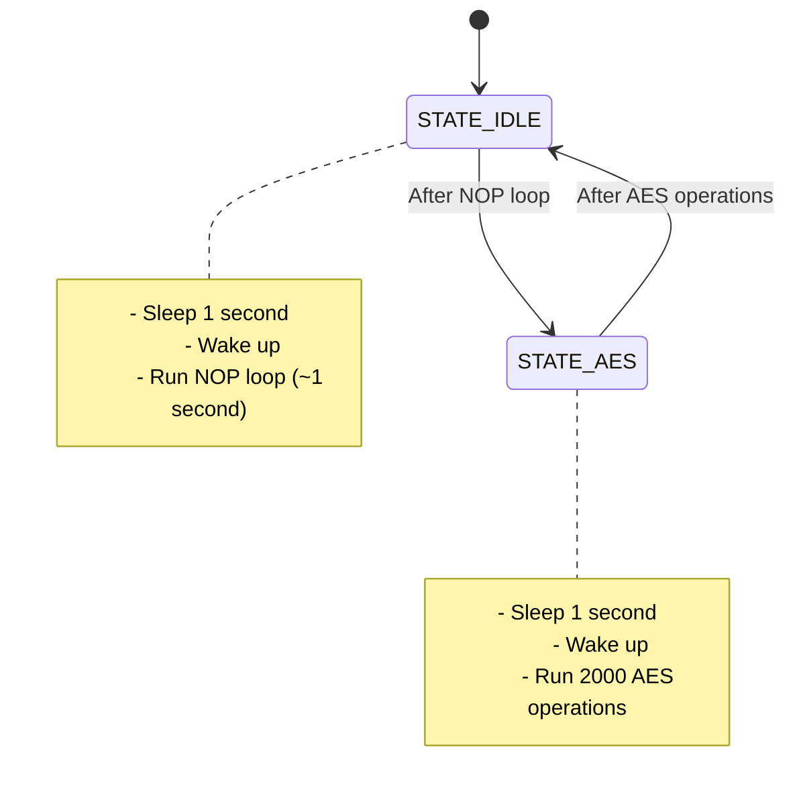

# P02 Energy Measurement - Solution Explanation

## Exercise Overview

This lab exercise measures the energy consumption of AES (Advanced Encryption Standard) encryption on an ARM Cortex-M4 microcontroller (STM32F429 Discovery Kit). The goal is to understand power consumption in different operational states and how cryptographic operations impact energy usage.

---

## Learning Objectives

1. Implement a Finite State Machine (FSM) in C
2. Perform energy measurements on an embedded system
3. Work with low-power modes on a microcontroller
4. Display and analyze voltage curves on an oscilloscope
5. Understand the energy cost of cryptographic operations

---

## Hardware Setup

### Energy Measurement Setup

**Components Required:**
- STM32F429 Discovery Kit on MC1-Board
- Oscilloscope with 2 probe heads
- Measurement resistor (replaces JP3 jumper)

**Measurement Principle:**
1. Remove JP3 jumper from MC1-Board
2. Replace with measurement resistor
3. Connect oscilloscope probes across the measurement resistor
4. Measure voltage drop across resistor
5. Calculate current using Ohm's Law: `I = V / R`
6. Calculate power: `P = V * I = V² / R`
7. Calculate energy: `E = P * t`

**Important:** Flash download only works with JP3 jumper or measurement resistor installed!

---

## Finite State Machine Design

### States

The FSM has **2 states**:

1. **STATE_IDLE**
   - Purpose: Measure baseline power consumption (doing nothing)
   - Behavior: Execute NOP (no operation) instructions in a loop

2. **STATE_AES**
   - Purpose: Measure power consumption during AES encryption
   - Behavior: Execute AES encryption/decryption operations

### State Diagram



### State Transitions

Each cycle through the FSM follows this pattern:

```
1. Sleep Mode (Low Power)
   ↓
2. Wake up after 1 second (via wakeup timer)
   ↓
3. Execute state-specific operation
   ↓
4. Transition to next state
   ↓
5. Repeat from step 1
```

---

## Implementation Details

### 1. Header Files

```c
#include "output.h"        // LED control
#include "wakeup_timer.h"  // Sleep timer configuration
#include "ese_aes.h"       // AES encryption functions
```

**Purpose:**
- `output.h`: Control user LEDs for visual feedback
- `wakeup_timer.h`: Configure automatic wakeup from sleep mode
- `ese_aes.h`: Perform AES-256 encryption/decryption

### 2. Global Variables

```c
typedef enum {
    STATE_IDLE,
    STATE_AES
} t_state;

static char aes_message[256] = {0};
```

**Explanation:**
- `t_state`: Enum defining the two FSM states
- `aes_message`: 256-byte buffer for AES operations
  - Initialized to zeros
  - Represents the message to encrypt/decrypt
  - Size can be varied to measure energy for different message lengths

### 3. Initialization

```c
output_init();
setOutputEnable(ENABLE);

t_state state = STATE_IDLE;
```

**Explanation:**
- Initialize output module (LEDs)
- Enable output functionality
- Start FSM in STATE_IDLE

### 4. Main Loop - FSM Implementation

```c
while(1) {
    // Configure wakeup timer for 1 second (0x3E80 = 16000 in hex)
    wakeup_init(0x3E80);

    // Enter sleep mode to save power
    power_enter_sleep();

    // After wakeup, execute state-specific behavior
    switch(state)
    {
        case STATE_IDLE:
            // Execute NOP (no operation) for ~1 second
            for (volatile uint32_t i = 0; i < 8000000; i++) {
                __asm volatile ("nop");
            }
            state = STATE_AES;
            break;

        case STATE_AES:
            // Perform AES encryption 2000 times
            for (uint32_t i = 0; i < 2000u; i++) {
                runAES(aes_message, sizeof(aes_message));
            }
            state = STATE_IDLE;
            break;
    }
}
```

---

## Code Analysis

### Wakeup Timer Configuration

```c
wakeup_init(0x3E80);
```

**Value Explanation:**
- `0x3E80` = 16,000 in decimal
- With the configured clock prescaler, this results in approximately 1 second
- The wakeup timer counts down from this value while in sleep mode

### Sleep Mode

```c
power_enter_sleep();
```

**Behavior:**
- Puts the microcontroller into low-power sleep mode
- CPU stops executing instructions
- Peripherals remain powered (depending on configuration)
- Significantly reduces power consumption
- Automatically wakes up when wakeup timer expires

### STATE_IDLE: NOP Loop

```c
for (volatile uint32_t i = 0; i < 8000000; i++) {
    __asm volatile ("nop");
}
```

**Purpose:**
- Provides a baseline for comparison
- Measures power consumption when CPU is active but doing minimal work
- `volatile`: Prevents compiler from optimizing away the loop
- `__asm volatile ("nop")`: Assembly instruction that does nothing
- 8,000,000 iterations ≈ 1 second at 168 MHz clock

### STATE_AES: Encryption Operations

```c
for (uint32_t i = 0; i < 2000u; i++) {
    runAES(aes_message, sizeof(aes_message));
}
```

**Purpose:**
- Measures power consumption during actual cryptographic work
- `runAES()`: Performs AES-256 encryption then decryption
- 2000 iterations: Provides sufficient duration for accurate measurement
- `sizeof(aes_message)` = 256 bytes: Can be varied to test different message sizes

---

## Energy Measurement Process

### On Oscilloscope

You will observe three distinct voltage levels:

1. **Sleep Mode** (Lowest voltage)
   - Minimal power consumption
   - Duration: ~1 second
   - CPU is halted

2. **IDLE State** (Medium voltage)
   - CPU active but executing NOPs
   - Duration: ~1 second
   - Baseline active power

3. **AES State** (Highest voltage)
   - CPU performing intensive calculations
   - Duration: Variable (depends on iteration count)
   - Shows peak power consumption

### Calculating Energy

For each state:

**Step 1: Measure voltage**
```
V_measured = voltage across measurement resistor (from oscilloscope)
```

**Step 2: Calculate current**
```
I = V_measured / R_measurement
```

**Step 3: Calculate power**
```
P = V_supply * I
```
Where `V_supply` = 3.3V (typical for STM32)

**Step 4: Calculate energy**
```
E = P * t
```
Where `t` = duration of the state (from oscilloscope)

### Example Calculation

Assuming:
- Measurement resistor: R = 0.1 Ω
- Measured voltage during AES: V = 0.05V
- Duration: t = 2 seconds

```
Current:  I = 0.05V / 0.1Ω = 0.5 A
Power:    P = 3.3V * 0.5A = 1.65 W
Energy:   E = 1.65W * 2s = 3.3 J (Joules)
```

---

## Expected Results

### Power Consumption Hierarchy

```
P_sleep << P_idle < P_aes
```

**Typical values might be:**
- Sleep mode: ~10 mW
- IDLE state: ~100-200 mW
- AES state: ~300-500 mW

*Note: Actual values depend on clock frequency, optimization, and hardware*

### Energy vs Message Size

When varying `aes_message` size, you should observe:

**Linear Relationship:**
```
E_aes ∝ message_size
```

Larger messages require:
- More encryption/decryption rounds
- More memory operations
- Longer execution time
- Proportionally more energy

**Example Data:**

| Message Size (bytes) | Energy (mJ) |
|---------------------|-------------|
| 64                  | ~500        |
| 128                 | ~1000       |
| 256                 | ~2000       |
| 512                 | ~4000       |
| 1024                | ~8000       |

---

## Testing Different Message Sizes

To measure energy for different message sizes, modify:

```c
// Change array size
static char aes_message[64] = {0};   // For 64 bytes
static char aes_message[128] = {0};  // For 128 bytes
static char aes_message[512] = {0};  // For 512 bytes
// etc.
```

And update the call:
```c
runAES(aes_message, sizeof(aes_message));
```

`sizeof(aes_message)` automatically adjusts to the array size.

---

## Key Insights

### 1. Sleep Mode is Critical
- Reduces power consumption by >90%
- Essential for battery-powered devices
- Wakeup timer enables periodic operation without constant polling

### 2. Cryptography is Expensive
- AES operations consume significantly more power than idle CPU
- For battery-powered IoT devices, minimize encryption frequency
- Consider hardware crypto accelerators (many STM32 have built-in AES engines)

### 3. Energy Scales with Workload
- Energy consumption is directly proportional to message size
- Predictable scaling helps with system design and battery sizing

### 4. Measurement Technique
- Oscilloscope allows real-time visualization
- Measurement resistor technique is non-intrusive
- Can identify unexpected power spikes or inefficiencies

---

## Practical Applications

### Battery Life Estimation

If your device encrypts 1 KB of data every 10 minutes:

```
Energy per encryption: ~8 mJ (from measurements)
Encryptions per day:    6 per hour * 24 hours = 144
Energy per day:         144 * 8 mJ = 1.152 J
```

For a 1000 mAh battery at 3.3V:
```
Battery capacity: 1000 mAh * 3.3V * 3600s/h = 11,880 J
Battery life:     11,880 J / 1.152 J/day = ~10,312 days
```

*Note: This is just for AES operations; add sleep and idle power for complete calculation*

### Optimization Strategies

1. **Hardware Acceleration**
   - Use built-in AES hardware if available
   - Can reduce energy by 10-100x

2. **Clock Scaling**
   - Run AES at lower clock speed if timing permits
   - Energy per operation decreases

3. **Batch Processing**
   - Encrypt multiple messages at once
   - Reduces sleep/wake overhead

4. **Algorithm Selection**
   - Consider lighter ciphers (ChaCha20, AES-128)
   - Trade security margin for energy savings

---

## Summary

This implementation demonstrates:

✅ **Simple 2-state FSM** for alternating between idle and encryption
✅ **Low-power sleep mode** with automatic wakeup
✅ **Measurable energy states** for oscilloscope analysis
✅ **Scalable message sizes** for energy profiling
✅ **Real-world energy measurement** techniques

The FSM cycles between sleep, idle, and encryption states, allowing clear measurement of power consumption in each mode. This provides valuable data for designing energy-efficient embedded systems with cryptographic requirements.
